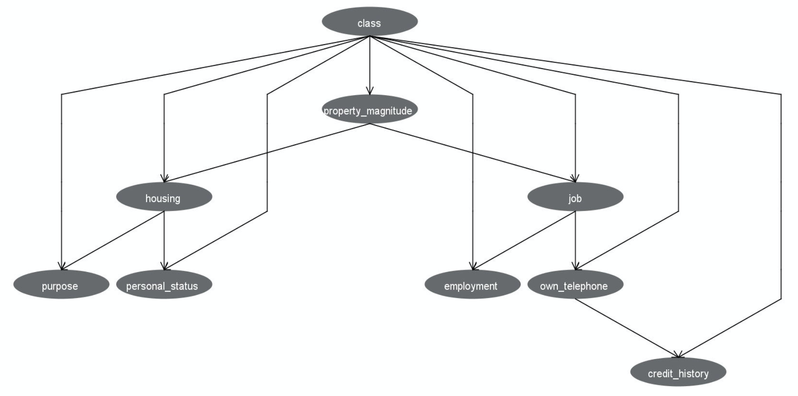

# A bayesian network implementation with Python. 
### Dataset is different type of german credit dataset.

Network:



Results
| TP | TN | FP | FN |
|----|----|----|----|
| 22 | 123 | 11 | 44 | 

| TPR | TNR | ACC |
|-----|-----|-----|
| 0.3333333333333333 | 0.917910447761194 | 0.725 |

class table (for check)
|x|     bad|    good|
|-|--------|--------|
|0|  0.2925|  0.7075|

To run:

```sh
$ python3 BayesianNetwork.py
```